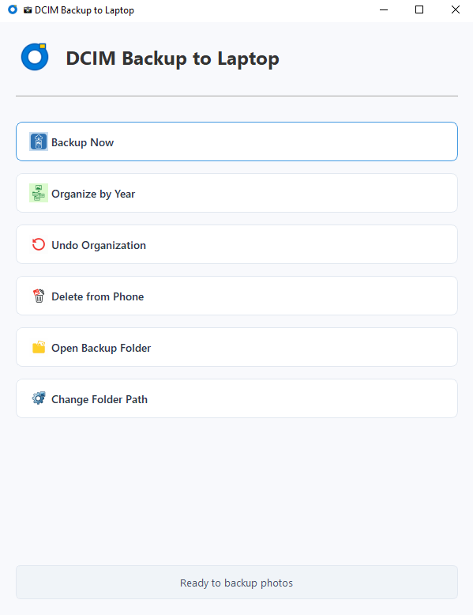

# 📸 DCIM Backup to Laptop

  
*A simple, efficient tool to backup and organize your Android photos*

## Table of Contents
- [Features](#features-)
- [Requirements](#requirements-)
- [Installation](#installation-)
- [Usage](#usage-)
- [Configuration](#configuration-)
- [Troubleshooting](#troubleshooting-)
- [Contributing](#contributing-)
- [License](#license-)
- [Acknowledgments](#acknowledgments-)

## Features ✨

- **Smart Backup**: Transfer photos/videos from device to laptop with one click
- **Automatic Organization**: Sort media by year using EXIF/metadata
- **Safe Cleanup**: Optionally delete backed-up files from your device
- **Duplicate Protection**: MD5 hash verification prevents duplicate files
- **Modern Interface**: Clean GUI with progress tracking
- **Cross-Platform**: Works on Windows, macOS, and Linux

## Requirements 📋

### Essential:
- Python 3.7 or newer
- Android device with USB debugging enabled
- [ADB Platform Tools](https://developer.android.com/tools/releases/platform-tools)

### Python Packages (auto-installed):
- PyQt5 (for GUI)
- hachoir (metadata extraction)
- tqdm (progress bars)
- Pillow (image processing)

## Installation 🛠️

### 1. Get the Code
```bash
git clone https://github.com/yourusername/dcim-backup.git
cd dcim-backup
```

### 2. Install Dependencies
```bash
pip install -r requirements.txt
```

### 3. Set Up ADB
#### Windows:
1. Download [platform-tools](https://developer.android.com/tools/releases/platform-tools)
2. Extract and place `adb.exe` in the `adb-tools` folder

#### macOS/Linux:
Option A - Use system package:
```bash
# Ubuntu/Debian
sudo apt install android-tools-adb

# macOS (Homebrew)
brew install android-platform-tools
```

Option B - Manual placement:
1. Download [platform-tools](https://developer.android.com/tools/releases/platform-tools)
2. Place ADB binaries in the `adb-tools` folder

## Usage 🚀

### GUI Mode (Recommended)
```bash
python dcim_backup.py
```

### Command Line Options
```bash
python dcim_backup.py [options]

Options:
  --backup       Run backup immediately (no GUI)
  --organize     Organize existing backups by year
  --folder PATH  Set backup folder path
```

### First Run Setup
1. Connect your Android device via USB
2. Enable USB Debugging:
   - Go to Settings > About Phone
   - Tap "Build Number" 7 times to enable Developer Options
   - In Developer Options, enable "USB Debugging"
3. Run the application and grant USB debugging permission on your device

## Configuration ⚙️

The app stores settings in two files:
1. `config.txt` - Backup folder location
2. `backup_log.txt` - MD5 hashes of backed-up files

To change settings:
- Use the in-app "Change Folder Path" button, or
- Manually edit `config.txt` (one line with full path to backup folder)

## Troubleshooting 🐛

### Common Issues

**Device Not Detected**
- ✅ Ensure USB debugging is enabled
- ✅ Try different USB cable/port
- ✅ Check `adb devices` in terminal shows your device

**Backup Fails**
- ✅ Grant storage permissions when prompted on device
- ✅ Try running as administrator (Windows)
- ✅ Ensure sufficient storage space on laptop

**Missing EXIF Data**
- ✅ Files without dates go to "Unknown" folder
- ✅ You can manually organize these later

**ADB Command Issues**
- ✅ Verify ADB is in correct location (`adb-tools` folder)
- ✅ On Linux/macOS, ensure ADB is executable:
  ```bash
  chmod +x adb-tools/adb
  ```

## Contributing 🤝

We welcome contributions! Here's how to help:

1. Fork the repository
2. Create a feature branch (`git checkout -b feature/amazing-feature`)
3. Commit your changes (`git commit -m 'Add amazing feature'`)
4. Push to the branch (`git push origin feature/amazing-feature`)
5. Open a Pull Request

Please report bugs and feature requests in the [Issues section](https://github.com/yourusername/dcim-backup/issues).

## License 📄

This project is licensed under the MIT License - see the [LICENSE](LICENSE) file for details.

## Acknowledgments 🙏

Special thanks to:
- The PyQt team for the GUI framework
- Hachoir project for metadata extraction
- All open-source projects that made this possible

---

📌 **Important Notes**:
1. This tool doesn't replace a complete backup solution
2. Always maintain multiple copies of important photos
3. Double-check before deleting files from your device

For support, please [open an issue](https://github.com/yourusername/dcim-backup/issues).